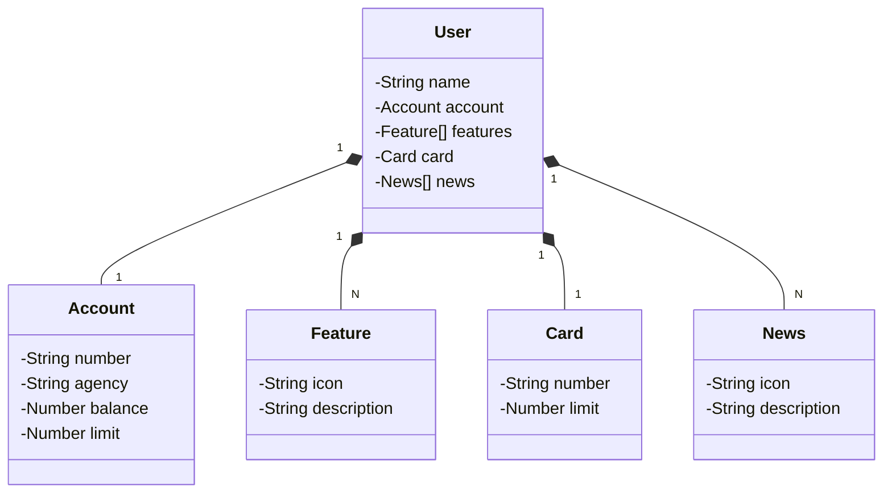

# Santander-dev-week-2023
Java RESTful API criada para a Santander Dev Week.

## Principais Tecnologias

*Java 17: Utilizaremos a versão LTS mais recente do Java para tirar vantagem das últimas inovações que essa linguagem robusta e amplamente utilizada oferece;

## Diagrama de Classes

